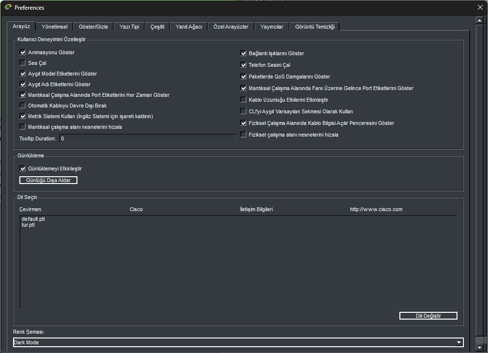

# Cisco Packet Tracer - Türkçe Dil Paketi

Cisco Packet Tracer için resmî olmayan, topluluk kaynaklı Türkçe dil dosyası.

Packet Tracer varsayılan olarak İngilizce, İspanyolca, Fransızca gibi birçok dilde gelir ancak Türkçe desteği bulunmaz. Bu repo, uygulamanın Qt Linguist tabanlı çeviri altyapısını kullanarak arayüzü Türkçeleştirir.

## Ekran görüntüsü



*Türkçeleştirilmiş Tercihler (Preferences) penceresi ve `tur.ptl`'in listelendiği "Dil Seçin" bölümü.*

## İçerik

| Dosya | Açıklama |
|---|---|
| `tur.ts` | Qt Linguist kaynak çeviri dosyası (XML, insan tarafından okunabilir/düzenlenebilir) |
| `tur.ptl` | `tur.ts`'den derlenmiş, Packet Tracer'ın doğrudan okuduğu ikili dil dosyası |
| `kur.bat` | Tek tıkla kurulum betiği (Windows): Packet Tracer'ı otomatik bulur ve dil dosyalarını kopyalar |

**10.298** arayüz metninin tamamı çevrilmiştir (menüler, diyaloglar, hata mesajları, Etkinlik Sihirbazı yardım metinleri, ağ cihazı arayüzleri vb.).

## Kurulum (tek tıkla — önerilen)

1. Bu depoyu indirin (**Code > Download ZIP**) ve arşivi bir klasöre çıkarın.
2. Packet Tracer'ı kapatın.
3. `kur.bat` dosyasına çift tıklayın ve çıkan Windows güvenlik uyarısında **Evet**'e basın (dosyalar `Program Files` altına kopyalandığı için yönetici izni gerekir).
4. Betik Packet Tracer kurulumunu kayıt defterinden ve standart dizinlerden otomatik bulur, bulamazsa sizden klasör yolunu ister (klasörü pencereye sürükleyip bırakabilirsiniz).
5. Packet Tracer'ı açın ve aşağıdaki "Dili etkinleştirme" adımlarını izleyin.

> `kur.bat` yalnızca Windows içindir. Linux/macOS'ta veya betiği çalıştırmak istemiyorsanız aşağıdaki elle kurulumu kullanın.

## Kurulum (elle)

1. Packet Tracer'ı kapatın.
2. `tur.ts` ve `tur.ptl` dosyalarını Packet Tracer kurulum dizinindeki `languages` klasörüne kopyalayın:
   ```
   C:\Program Files\Cisco Packet Tracer 9.0.0\languages\
   ```
   (Bu klasör yönetici izni gerektirdiğinden dosyaları yönetici olarak çalıştırılan bir terminalden kopyalamanız gerekebilir.)

## Dili etkinleştirme

1. Packet Tracer'ı açın.
2. **Options > Preferences** (veya **Change Language...**) bölümüne gidin.
3. **Dil Seçin / Select Language** listesinden `tur.ptl` (veya **Turkish**) seçeneğini işaretleyin.
4. **Change Language / Dili Değiştir** düğmesine tıklayın ve Packet Tracer'ı yeniden başlatın.

> Not: Sürüme bağlı olarak Packet Tracer'ın dil listesine yeni bir dilin görünmesi için ek bir yapılandırma dosyasında dil kodunun kayıtlı olması gerekebilir. Dil seçeneklerinde "Turkish" görünmüyorsa lütfen bir issue açın.

## Bu çeviri nasıl üretildi

- Kaynak metinler, Packet Tracer'ın `template.ts` dosyasından (Qt Linguist kaynak şablonu) çıkarıldı.
- 10.298 metin, yapay zekâ destekli çoklu-ajan bir çeviri hattıyla (her biri ~600 metinlik 18 paralel grup) Türkçeye çevrildi.
- Çeviri sırasında şunlar korundu:
  - `%1`, `%2` gibi yer tutucu değişkenler
  - `Ctrl+F4` gibi klavye kısayolları
  - URL'ler, dosya yolları, teknik tanımlayıcılar
  - `&Dosya` gibi klavye erişim tuşu (mnemonic) işaretleri
  - Metin içinde geçen HTML etiketleri
- `tur.ts` → `tur.ptl` derlemesi Packet Tracer'ın kendi kurulumuyla gelen `lrelease.exe` aracıyla yapıldı.

## Bilinen sınırlamalar

- Çeviri büyük ölçüde otomatik üretildiği için bazı cümlelerde bağlamsal küçük hatalar veya doğallaştırılması gereken ifadeler olabilir.
- Ağ/IT terminolojisi Cisco'nun resmî Türkçe dokümantasyon üslubuna yakın tutulmaya çalışılmıştır (`Router` → `Yönlendirici`, `Switch` → `Anahtar` vb.) ancak tam tutarlılık garanti edilmez.
- Regresyon/QA testi Packet Tracer arayüzünde uçtan uca yapılmamıştır.

## Katkıda bulunma

Hatalı veya iyileştirilebilir bir çeviri gördüyseniz:
1. `tur.ts` dosyasını bir metin editörüyle (veya Qt Linguist ile) açın, ilgili `<source>` metnine karşılık gelen `<translation>` alanını düzeltin.
2. Pull request gönderin.

Qt Linguist ile çalışmak isterseniz, Packet Tracer kurulumundaki `bin/linguist.exe` aracını kullanabilirsiniz.

## Lisans

Bu repo yalnızca çeviri dosyalarını içerir; Cisco Packet Tracer'ın kendisi Cisco Systems, Inc.'e aittir ve bu proje Cisco ile bağlantılı veya onun tarafından onaylanmış değildir. Çeviri dosyaları MIT lisansı ile paylaşılmıştır.
